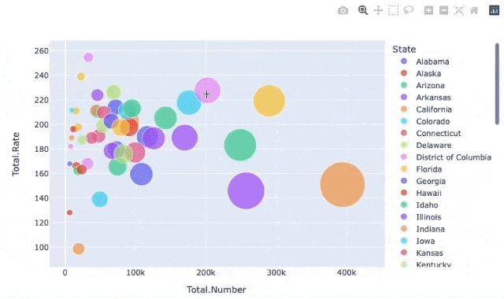
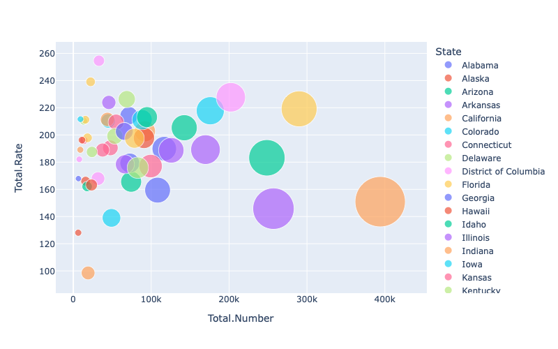
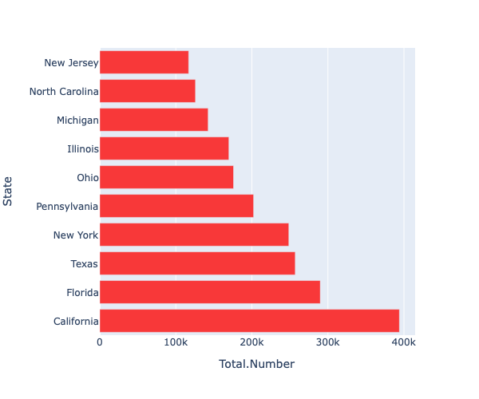
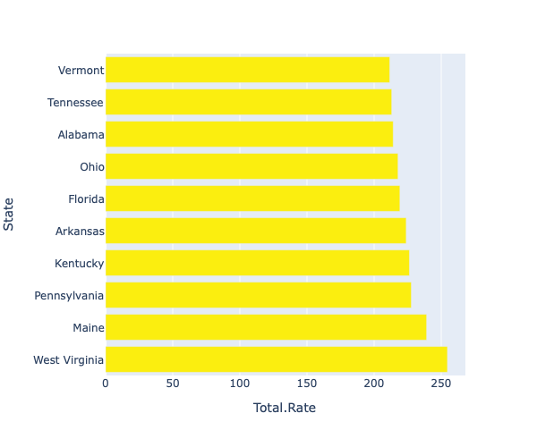
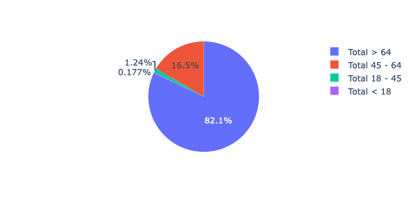
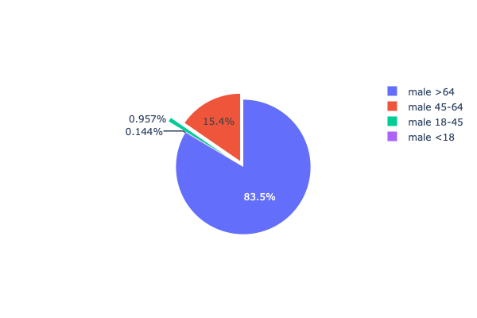
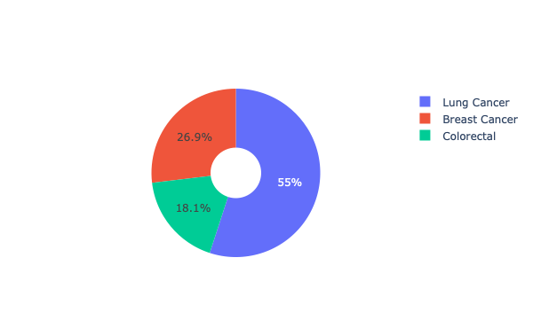
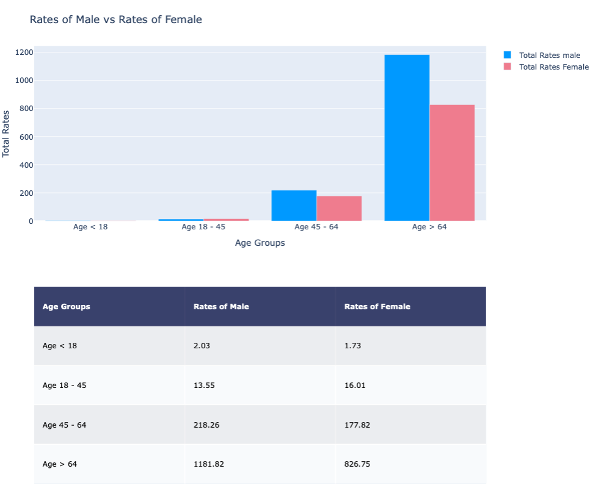
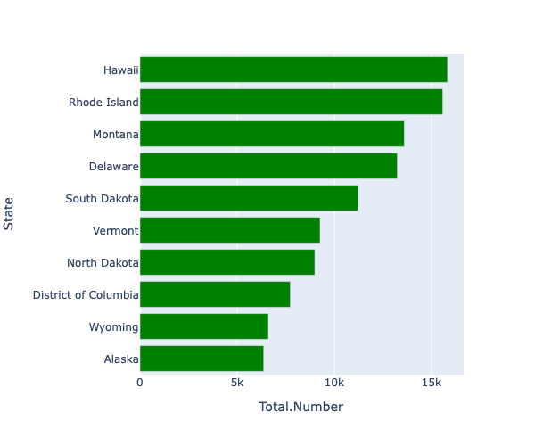
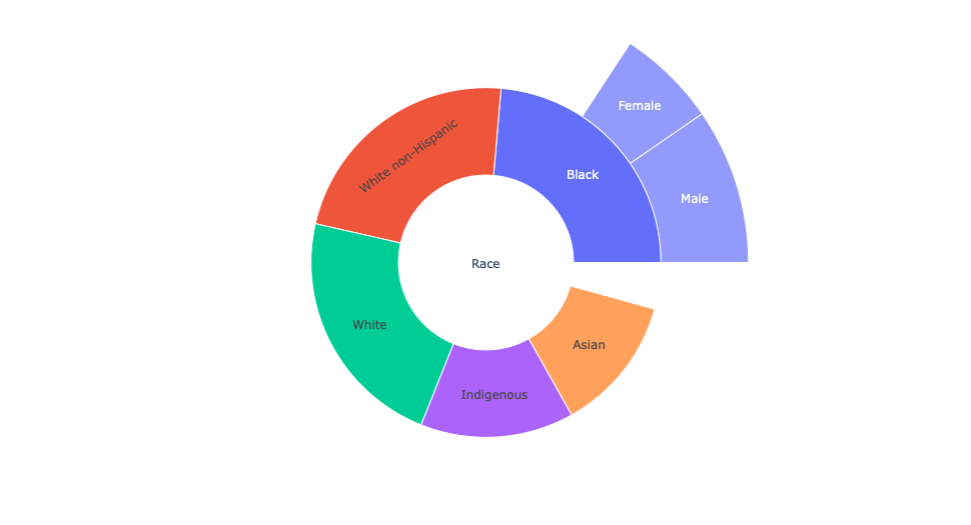

# interactive-data-visualisation
## All Charts shown are interactive


## Click on the charts below to interact

```python
fig = px.scatter(df,
                 x="Total.Number",
                 y='Total.Rate',
                 size='Total.Population',
                 size_max=len(df),
                 hover_name='State',
                 color='State')
fig.update_layout(autosize=False,width=800,height=500)
fig.show()
```
<a href = "https://gallant-varahamihira-00de8c.netlify.app"></a>

```python
fig = px.bar(max_cases,x='Total.Number',y='State',color_discrete_sequence=['#F83839']*len(max_cases))
fig.update_layout(autosize=False,width=600,height=500)
fig.show()
```
<a href = "https://vigilant-noether-51647d.netlify.app"></a>

```python
fig = px.bar(max_rates,x='Total.Rate',y='State',color_discrete_sequence=['#FBEE0F']*len(max_rates))
fig.update_layout(autosize=False,width=600,height=500)
fig.show()
```
<a href = "https://vigorous-colden-a31cb7.netlify.app"></a>

```python
fig = px.pie(rate_age,values=rate_age.iloc[0,4:],
             names=['Total < 18','Total 18 - 45','Total 45 - 64','Total > 64'],
             width=600,height=300)
fig.show()
```
<a href = "https://competent-swirles-080b08.netlify.app"></a>

```python
fig = go.Figure(data=[go.Pie(labels=male.columns[5:],values=male.iloc[0,5:],pull=[0,0.3,0.1,0])])
fig.update_layout(autosize=False,width=600,height=400)
fig.show()
```
<a href = "https://vibrant-nobel-bf2888.netlify.app"></a>

```python
fig = go.Figure(data=[go.Pie(labels=['Breast Cancer','Colorectal','Lung Cancer'],
             values=cancer_type.values,hole=.3)])
fig.update_layout(autosize=False,width=600,height=370)
fig.show()
```
<a href = "https://hopeful-pike-afebb7.netlify.app"></a>

```python
fig.layout.margin.update({'t':75, 'l':50})
fig.layout.update({'title': 'Rates of Male vs Rates of Female'})
fig.layout.update({'height':800})
fig.show()
```
<a href = "https://vibrant-joliot-591173.netlify.app"></a>

```python
fig = px.bar(min_cases,x='Total.Number',y='State',color_discrete_sequence=['green']*len(min_cases))
fig.update_layout(autosize=False,width=600,height=500)
fig.show()
```
<a href = "https://quizzical-booth-b34ece.netlify.app"></a>

```python
fig =go.Figure(go.Sunburst(
    labels=labels,
    parents=parents,
    values=[10]+[round(item,2)/10 for item in list(races)] + r
))
fig.update_layout(margin = dict(t=0, l=0, r=0, b=0))
fig.show()
```
`Multiply by 10 in all the scalars obtained in plot below`
<a href = "https://eager-hugle-7a39ff.netlify.app"></a>


